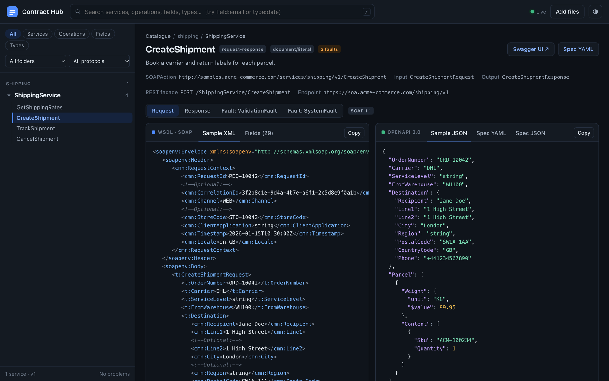

# Contract Hub

Drop WSDL and XSD files into a folder. Contract Hub lists every service and operation with sample SOAP request and response payloads, and shows an auto-generated OpenAPI 3.0 spec beside them.



## Quick start

Requires Docker.

```bash
docker compose up --build -d
```

Open **http://localhost:8090**.

To stop it:

```bash
docker compose down
```

## Add a service

Copy the service folder (the WSDL plus its XSDs) into `catalogue/`:

```bash
cp -R ~/path/to/MyService catalogue/
```

It shows up in the browser within a few seconds, with no refresh needed. You can also drag files or folders onto the browser window, or click **Add files**.

- Keep each WSDL next to the XSDs it imports. Relative `schemaLocation` paths must resolve.
- Shared schemas can live in their own folder, for example `catalogue/shared/`.
- An XSD that nothing imports is listed as its own entry.
- To remove a service, delete its folder.

## Try the sample

```bash
cp -R examples/* catalogue/
```

This adds **ShippingService** (4 operations) and the shared schema it uses.

## Find things

Type in the search bar, or press `/` to focus it. Narrow the search with prefixes:

| Prefix | Example | Finds |
|---|---|---|
| `svc:` | `svc:shipping` | Services |
| `op:` | `op:track` | Operations |
| `field:` | `field:postal` | Fields by name or path |
| `type:` | `type:date` | Fields of a type, and schema types |
| `dir:` | `dir:response` | Fields in requests, responses or faults |

Combine them freely, e.g. `op:create field:weight`. The sidebar also filters by folder and protocol.

## Favorites

Click the ☆ next to any service, operation or element to pin it. Favorites appear at the top of the sidebar and on the dashboard. They are saved in your browser, so each person keeps their own list.

## Operation view

- **Left:** a sample SOAP envelope and a field table with types, occurrence and constraints.
- **Right:** a sample JSON body and the OpenAPI spec for that operation.
- Switch between **Request**, **Response** and each **Fault**, and between SOAP 1.1 and 1.2.

The service page links to **Swagger UI** and to the full spec as YAML or JSON.

## Run without Docker

Requires Node 20+.

```bash
npm install
npm start          # watches ./catalogue on port 8090
npm run demo       # serves ./examples instead
```

## Settings

| Variable | Default | Purpose |
|---|---|---|
| `PORT` | `8090` | HTTP port |
| `CATALOGUE_DIR` | `./catalogue` | Folder to watch |
| `WATCH_INTERVAL` | `2000` | Fallback folder scan interval, in ms |
| `MAX_UPLOAD_MB` | `20` | Upload size limit per file |

To use another port with Docker, change `"8090:8090"` in `docker-compose.yml` to, for example, `"9000:8090"`.

## Troubleshooting

| Problem | Fix |
|---|---|
| `port is already allocated` | Another app is using 8090. Stop it or change the port as shown above. |
| A dropped service doesn't appear | Check that it's inside *this project's* `catalogue/` folder, then click **Rescan** on the dashboard. |
| The footer shows problems | Open the dashboard to see which file failed: usually invalid XML or a missing imported XSD. |
| Remote imports (`http://…`) are reported | They are not downloaded. Save those schemas into the folder and point `schemaLocation` at them. |

## API

| Endpoint | Returns |
|---|---|
| `GET /api/catalogue` | All services and problems |
| `GET /api/services/:id` | Operations, samples and field tables |
| `GET /api/services/:id/openapi.yaml` (or `.json`) | Full OpenAPI spec |
| `GET /api/search?q=…&kind=field` | Search results |
| `POST /api/upload` | Upload files (multipart `files`) |
| `POST /api/rescan` | Force a rescan |
